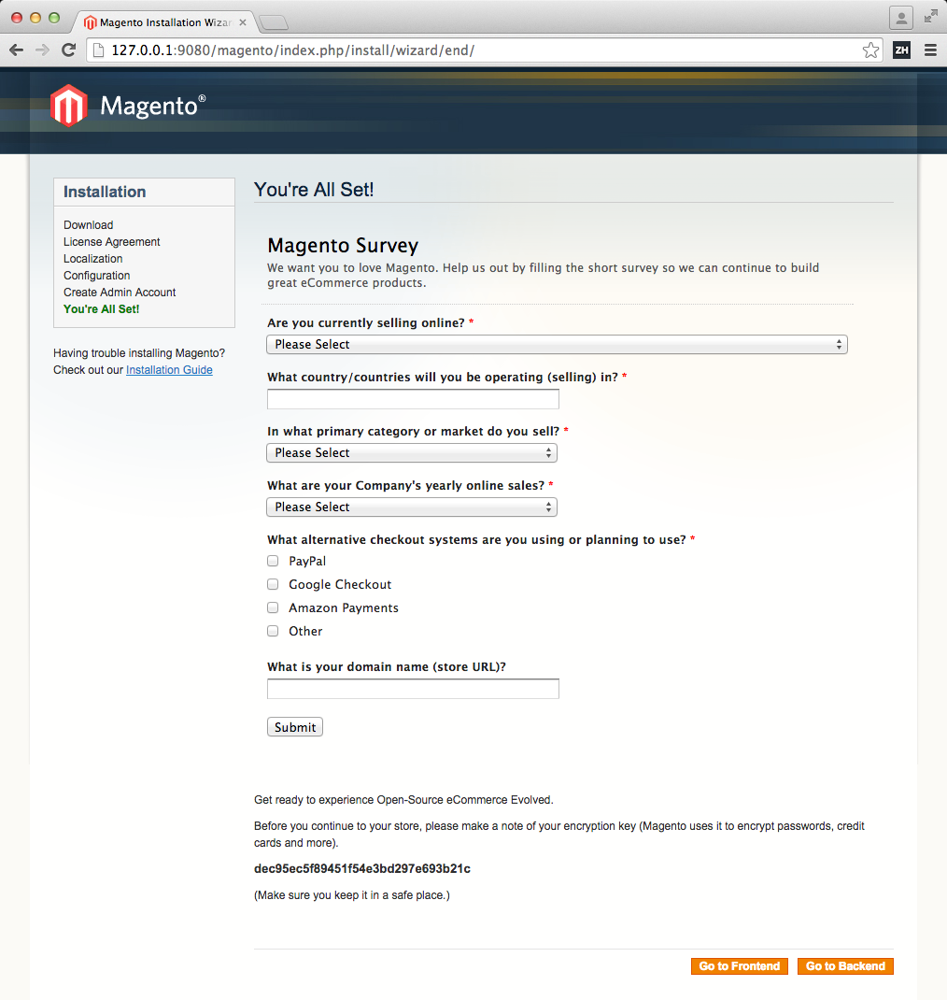
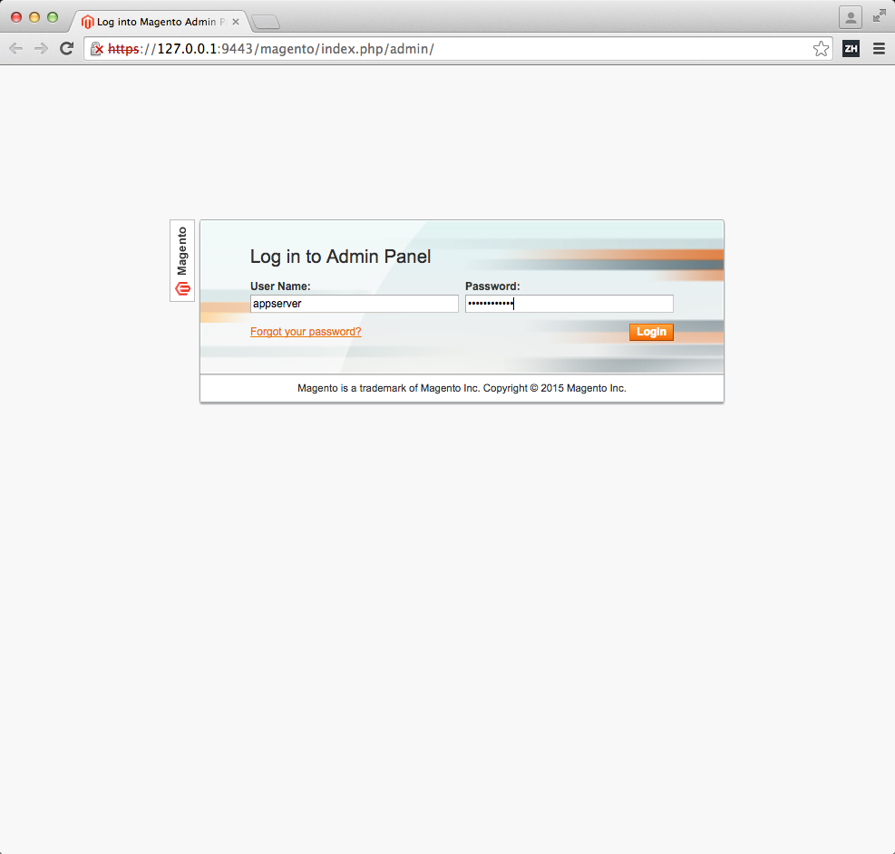
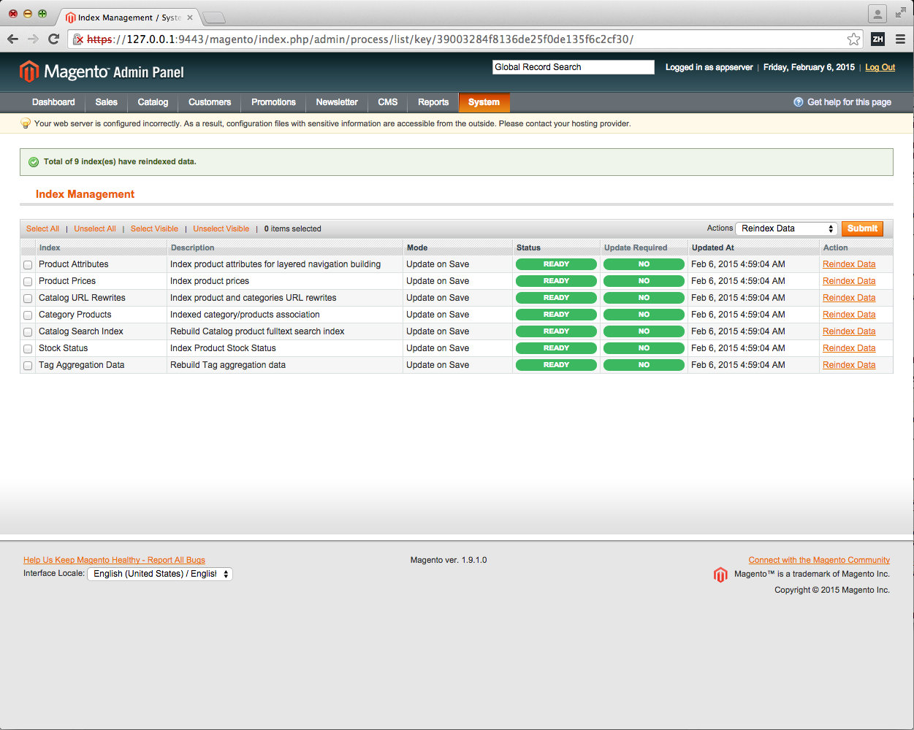

appserver.io is a pretty cool and sophisticated infrastructure fully built upon the PHP stack. This makes it truly easy to develop and extend the platform. appserver.io comes with a built in webserver module that provides Fast-CGI support. Therefore it is possible to run and install any PHP application. The following tutorial guides you through the Magento installation process necessary to run on appserver.io.


**Prerequisite**: *Up and running installation of MySQL*

You will need a running installation of appserver.io *(>= Version 1.0.0-rc3)*. If you are new to this
project you can easily <a href="{{site.home_url}}downloads" target="_blank" class="external no-image">download</a> and follow the
[installation guide](../../documentation/installation) for your specific OS.

After the setup has finished the appserver.io is up and running and you can call the welcome page with

[http://localhost:9080/](http://localhost:9080/)

By default, appserver.io is configured to run on port `9080` in order to not to affect any existing webserver installations.
You can easily change that in the /opt/appserver/etc/appserver.xml just by going to section

```xml
<server name="http"
	...
```

and change the port within that section for example to 80. After that restart the appserver.io which can be
done with the following command.

```bash
sudo /opt/appserver/sbin/appserverctl restart
```

Of course there is no need to change the port if you only want to check out the capabilities of `appserver.io`


## Installation

To start, you have to [download](http://www.magentocommerce.com/download) the latest Magento CE version from the Magento website.

To install Magento, we have now two options. The easiest way is to install Magento without creating a vhost. Therefore you just extract the Magento source into the document root under `/opt/appserver/webapps` by opening a commandline and type

```bash
$ cd /opt/appserver/webapps
$ tar xvfz magento-community-1.9.1.0.tar.gz
```

This will create a folder `magento` and extracts the Magento source files to it. Before you are able to step through the installation you **MUST** correct the rights of the `magento` folder to ensure Magento is able to write the configuration files.

```bash
sudo chown -R _www:staff magento
sudo chmod -R 775 magento
```

In addition, Magento requires an existing MySQL database and a user that has access to the database. To create the database and the user, use the MySQL command line utilities. To log in to the MySQL command line utilities, type

```bash
$ mysql -uroot -p
```

After successful login, create the database, the user and the password with

```bash
mysql> create database magento;
mysql> grant all on magento.* to "magento"@"localhost" identified by "magento";
mysql> flush privileges;
```

Optional you can use another database administration tool like `phpMyAdmin` to create the database. Of course you can also install [phpMyAdmin](../running-phpmyadmin) on appserver.io.

Now, as you are prepared to step through the Magento installer, start your favorite browser and open 
`http://127.0.0.1:9080/magento`.


The first step of the Magento installation wizard contains the OSL license and a checkbox that allows to agree to the Magento Terms and Conditions. By activating the checkbox, you agree to the Magento terms and conditions and are able to proceed to step 2 by clicking on the button `Continue`.


The first fieldset `Database Connection` requires the database configuration. As you have created a database and the necessary user credentials before, you have to enter these values here.

The second fieldset `Web access options` allows, beside the standard options, to activate SSL to use secure URLs for the admin interface. As `appserver.io` generates a default wildcard SSL certificate on startup, you can activate the `Use Secure URLs (SSL)` checkbox.

After activation, another field and a checkbox will appear. As the default port for SSL connections on `appserver.io` is, by default, **NOT** `443`, you've to correct the preset URL to `https://127.0.0.1:9443/magento/`. Then activate the checkbox `Run admin interface with SSL`. All other options are good with their default values.

> Generation of a self-signed `SSL` certificate can be tricky in some cases. `appserver.io` generates a self-signed `SSL` wildcard certificate during startup, without additional effort! You can find the generated certificate in the configuration directory under `/opt/appserver/etc/appserver/server.pem`. If you'll delete it, it'll be re-created with the next startup.

Proceed to step 3 by clicking on the button `Continue`.


The final step of the installation wizard allows to create an admin account. This is necessary to login to the `admin` panel. Enter your personal data and the user credentials here. The `Encryption Key` is optional, so you do not have to enter any data here.

Finish the installation wizard by clicking on the button `Continue`.



> Congratulations, you have successfully installed Magento on your local `appserver.io` infrastructure!

## Securing your Installation

In contrast to an installation on the `Apache` webserver, `appserver.io` actually can not parse `.htaccess` files. So it is necessary to secure your installation manually by adding the apropriate directives to the `appserver.xml` configuration file.

So, after the installation process, described above, the next step is to login to the `admin` panel. To do this, open `http://127.0.0.1:9080/magento/index.php/admin`



and login with the user credentials that you created before. Delete the unread messages and update the `Indexers`. There will be one message left below the top navigation.



This message is a result of a Magento internal security check that tries to open the previously generated `/opt/appserver/webapps/magento/app/etc/config.xml` by simulating a browser. Try it by yourself! Start your favorite browser and open `http://127.0.0.1:9080/magento/app/etc/config.xml`. You should see a page very similar to this


This means, depending on your `appserver.io` configuration, your Magento configuration, including DB username and password, is visible to everyone that can access your IP. To solve this is pretty simple!

Open `/opt/appserver/etc/appserver/appserver.xml` file with the editor of your choice (you need admin access to edit this file).

First comment out the `<access type="allow">...</access>`, but explicitly allow Magento `index.php`, `media`, `skin` and `js` by adding the following lines to the `<accesses>` node.

```xml
<access type="allow">
    <params>
        <param name="X_REQUEST_URI" type="string">
            ^\/magento\/([^\/]+\/)?(media|skin|js|index\.php).*
        </param>
    </params>
</access>
```

Now the `appserver.xml` file should look like this

```xml
<appserver ... >
	<containers>
	    <container name="combined-appserver">
	    	<servers>
	    		...
	    		<server name="http" ...>
    				...
				<accesses>
				        <!-- per default deny everything -->
				        <!-- access type="allow">
				            <params>
				                <param name="X_REQUEST_URI" type="string">.*</param>
				            </params>
				        </access -->
				        <access type="allow">
				            <params>
				                <param name="X_REQUEST_URI" type="string">
				                    ^\/magento\/([^\/]+\/)?(media|skin|js|index\.php).*
				                </param>
				            </params>
				        </access>
				</accesses>
				...
			</server>
	    		<server name="https" ...>
    				...
				    <accesses>
				        <!-- per default deny everything -->
				        <!-- access type="allow">
				            <params>
				                <param name="X_REQUEST_URI" type="string">.*</param>
				            </params>
				        </access -->
				        <access type="allow">
				            <params>
				                <param name="X_REQUEST_URI" type="string">
				                    ^\/magento\/([^\/]+\/)?(media|skin|js|index\.php).*
				                </param>
				            </params>
				        </access>
				    </accesses>
				    ...
				</server>
			</servers>
		</container>
	</containers>		    			
</appserver>
```

[Restart](../../documentation/basic-usage#start-and-stop-scripts) the application server and open the dashboard again. The security warning should have been gone!

## Adding Rewrites

Adding rewrite funtionality for your Magento installation is a very similar process as to make it secure. Add the following lines to `<server name="http">...</server>` and  `<server name="https">...</server>` nodes.

```xml
<rewrites>
	<rewrite condition="-d{OR}-f{OR}-l" target="" flag="L" />
        <rewrite condition="/magento/(.*)" target="index.php/$1" flag="L" />
</rewrites>
```

[Restart](../../documentation/basic-usage#start-and-stop-scripts) the application server and proceed to activate the Magento Rewrite functionality in the `admin` panel.

## Virtual Host Configuration

To use a virtual host to run Magento, follow the steps below. As with any other webserver using a virtual host, first add the domain you like to use in your hosts file.

Assuming `magento.dev` is the domain where you want the local installation to be available, you have to do the following steps. First, open the `/etc/hosts` (you need admin access) with your favorite editor and add the following lines

```bash
::1 magento.dev
127.0.0.1 magento.dev
fe80::1%lo0 magento.dev
```

and save the file. 

Then add a virtual host node to the webserver configuration that you will find in `/opt/appserver/etc/appserver/conf.d/virtual-hosts.xml`. Here is already an example virtual host configuration available. Add the following configuration within the `<virtualHosts>` node.

```xml
<virtualHost name="magento.dev">
    <params>
        <param name="documentRoot" type="string">webapps/magento</param>
    </params>
    <rewrites>
        <rewrite condition="-d{OR}-f{OR}-l" target="" flag="L" />
        <rewrite condition="(.*)" target="index.php/$1" flag="L" />
    </rewrites>
    <accesses>
        <access type="allow">
            <params>
                <param name="X_REQUEST_URI" type="string">
                    ^\/([^\/]+\/)?(media|skin|js|index\.php).*
                </param>
            </params>
        </access>
    </accesses>
</virtualHost>
```

After adding the virtual host [restart](../../documentation/basic-usage#start-and-stop-scripts) the application server.

As Magento stores the base URL of the shop in the database, you  **MUST** change these URLs in the database. Again, login to the `MySQL` command line with 

```bash
$ mysql -uroot -p
```

and execute the following SQL statements

```sql
UPDATE magento.core_config_data \ 
   SET value = 'https://magento.dev:9443/' \ 
 WHERE path = 'web/secure/base_url';
 
UPDATE magento.core_config_data \
   SET value = 'http://magento.dev:9080/' \ 
WHERE path = 'web/unsecure/base_url';
```

Clear the Magento cache by executing

```bash
$ sudo rm -rf /opt/appserver/webapps/magento/var/cache/*
```

and you are all set. Start your favorite browser and open the URL `http://magento.dev:9080`, voilá!

## Rotating Logfiles

Rotating the Magento Logfiles can also be activated by adding the following lines below the `params` node

```xml
<appserver ... >
    ...
    <scanners>
        <scanner 
            name="logrotate-magento" 
            type="AppserverIo\Appserver\Core\Scanner\LogrotateScanner">
            <params>
                <param name="interval" type="integer">1</param>
                <param name="extensionsToWatch" type="string">log</param>
                <param name="maxFiles" type="integer">10</param>
                <param name="maxSize" type="integer">1048576</param>
            </params>
            <directories>
                <directory>webapps/magento/var/log</directory>
            </directories>
         </scanner>
    </scanners>
    ...
</appserver>
```

> Keep in mind, that the directory `webapps/magento/var/log` has to be relative from the application servers base directory. You can also add multiple `<directory>` nodes pointing to directories containing files to be rotated.

After [restarting](../../documentation/basic-usage#start-and-stop-scripts) the application server, your Magento log files will be rotated every day, or if they reached 1 MB.

## Executing Magento CRON Jobs

When you run Magento on a Debian Linux for example, you have to register the `cron.sh` in your systems CRON table to be executed periodically. This is, for sure, **NO** big deal, but it might come together with some handicaps like missing permissions for example. If you run Magento inside `appserver.io`, life will be less complicated, because you are able to execute the Magento CRON by a `Stateless` session bean.

Creating a `Stateless` session bean is very simple, because this is a plain PHP class with some annotations. Let us have a look at an example you can find in one of our [repositories](https://github.com/appserver-io-apps/magento-cron).

```php
<?php

/**
 * AppserverIo\Apps\Magento\Cron\SessionBeans\CronSessionBean
 *
 * NOTICE OF LICENSE
 *
 * This source file is subject to the Open Software License (OSL 3.0)
 * that is available through the world-wide-web at this URL:
 * http://opensource.org/licenses/osl-3.0.php
 *
 * PHP version 5
 *
 * @author    Tim Wagner <tw@appserver.io>
 * @copyright 2015 TechDivision GmbH <info@appserver.io>
 * @license   http://opensource.org/licenses/osl-3.0.php Open Software License (OSL 3.0)
 * @link      https://github.com/appserver-io-apps/magento-cron
 * @link      http://www.appserver.io
 */

namespace AppserverIo\Apps\Magento\Cron\SessionBeans;

use AppserverIo\Psr\Application\ApplicationInterface;
use AppserverIo\Psr\EnterpriseBeans\TimerInterface;
use AppserverIo\Psr\EnterpriseBeans\TimedObjectInterface;

/**
 * A stateless session bean that invokes the magento CRON job.
 *
 * @author    Tim Wagner <tw@appserver.io>
 * @copyright 2015 TechDivision GmbH <info@appserver.io>
 * @license   http://opensource.org/licenses/osl-3.0.php Open Software License (OSL 3.0)
 * @link      https://github.com/appserver-io-apps/magento-cron
 * @link      http://www.appserver.io
 *
 * @Stateless
 */
class CronSessionBean implements TimedObjectInterface
{

    /**
     * The application instance that provides the entity manager.
     *
     * @var \AppserverIo\Psr\Application\ApplicationInterface
     * @Resource(name="ApplicationInterface")
     */
    protected $application;

    /**
     * Example method that should be invoked after constructor.
     *
     * @return void
     * @PostConstruct
     */
    public function initialize()
    {
        $this->getInitialContext()->getSystemLogger()->info(
            sprintf('%s has successfully been invoked by @PostConstruct annotation', __METHOD__)
        );
    }

    /**
     * The application instance providing the database connection.
     *
     * @return \AppserverIo\Psr\Application\ApplicationInterface The application instance
     */
    public function getApplication()
    {
        return $this->application;
    }

    /**
     * Returns the initial context instance.
     *
     * @return \AppserverIo\Appserver\Application\Interfaces\ContextInterface The initial context instance
     */
    public function getInitialContext()
    {
        return $this->getApplication()->getInitialContext();
    }

    /**
     * Invokes the Magento CRON implementation.
     *
     * @return void
     * @throws \Exception
     */
    public function invoke()
    {

        try {

            // backup the old working directory
            $oldDir = getcwd();

            // change current directory to the applications intallation directory
            chdir($this->getApplication()->getWebappPath());

            // initialize Mage
            require_once $this->getApplication()->getWebappPath() . '/app/Mage.php';

            // query whether Magento has been installed or not
            if (\Mage::isInstalled() === false) {
                throw new \Exception('Magento is not installed yet, please complete install wizard first.');
            }

            // configure Magento to run the CRON jobs
            \Mage::app('admin')->setUseSessionInUrl(false);
            \Mage::getConfig()->init()->loadEventObservers('crontab');
            \Mage::app()->addEventArea('crontab');

            // dispatch the events that executes the CRON jobs
            \Mage::dispatchEvent('always');
            \Mage::dispatchEvent('default');

            // restore the old working directory
            chdir($oldDir);

            // log a mesage that Magento CRON has been invoked successfully
            $this->getInitialContext()->getSystemLogger()->debug(
                sprintf('%s has successfully been invoked at %s', __METHOD__, date('Y-m-d H:i:s'))
            );

        } catch (Exception $e) {
            $this->getInitialContext()->getSystemLogger()->error($e->__toString());
        }
    }

    /**
     * Method invoked by the container upon timer schedule that will
     * invoke the Magento CRON handler.
     *
     * This method will be invoked every minute!
     *
     * @param TimerInterface $timer The timer instance
     *
     * @return void
     * @Schedule(dayOfMonth = EVERY, month = EVERY, year = EVERY, second = ZERO, minute = EVERY, hour = EVERY)
     */
    public function invokedByTimer(TimerInterface $timer)
    {

        // let the timer service invoke the CRON
        $this->invoke();

        // log a message that the CRON has been invoked by the timer service
        $this->getInitialContext()->getSystemLogger()->debug(
            sprintf('%s has successfully been invoked by @Schedule annotation', __METHOD__)
        );
    }

    /**
     * Invoked by the container upon timer expiration.
     *
     * @param \AppserverIo\Psr\EnterpriseBeans\TimerInterface $timer Timer whose expiration caused this notification
     *
     * @return void
     **/
    public function timeout(TimerInterface $timer)
    {
        $this->getInitialContext()->getSystemLogger()->info(
            sprintf('%s has successfully been by interface', __METHOD__)
        );
    }
}
```

You have the choice. Either, save the PHP code from above into your Magento application folder `/opt/appserver/webapps/magento` under `META-INF/classes/AppserverIo/Apps/Magento/Cron/SessionBeans/CronSessionBean.php` or read the [installation](https://github.com/appserver-io-apps/magento-cron#installation) instructions of the repository.

After [restarting](../../documentation/basic-usage#start-and-stop-scripts) the application server, your Magento CRON jobs will be executed every minute.

## Summary

After finishing this tutorial, you have a completely optimized Magento installation ready for production or your local development process.